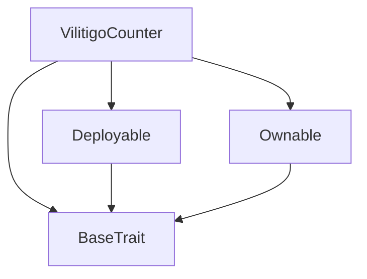
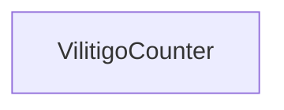

# Tact compilation report
Contract: VilitigoCounter
BoC Size: 3429 bytes

## Structures (Structs and Messages)
Total structures: 23

### DataSize
TL-B: `_ cells:int257 bits:int257 refs:int257 = DataSize`
Signature: `DataSize{cells:int257,bits:int257,refs:int257}`

### SignedBundle
TL-B: `_ signature:fixed_bytes64 signedData:remainder<slice> = SignedBundle`
Signature: `SignedBundle{signature:fixed_bytes64,signedData:remainder<slice>}`

### StateInit
TL-B: `_ code:^cell data:^cell = StateInit`
Signature: `StateInit{code:^cell,data:^cell}`

### Context
TL-B: `_ bounceable:bool sender:address value:int257 raw:^slice = Context`
Signature: `Context{bounceable:bool,sender:address,value:int257,raw:^slice}`

### SendParameters
TL-B: `_ mode:int257 body:Maybe ^cell code:Maybe ^cell data:Maybe ^cell value:int257 to:address bounce:bool = SendParameters`
Signature: `SendParameters{mode:int257,body:Maybe ^cell,code:Maybe ^cell,data:Maybe ^cell,value:int257,to:address,bounce:bool}`

### MessageParameters
TL-B: `_ mode:int257 body:Maybe ^cell value:int257 to:address bounce:bool = MessageParameters`
Signature: `MessageParameters{mode:int257,body:Maybe ^cell,value:int257,to:address,bounce:bool}`

### DeployParameters
TL-B: `_ mode:int257 body:Maybe ^cell value:int257 bounce:bool init:StateInit{code:^cell,data:^cell} = DeployParameters`
Signature: `DeployParameters{mode:int257,body:Maybe ^cell,value:int257,bounce:bool,init:StateInit{code:^cell,data:^cell}}`

### StdAddress
TL-B: `_ workchain:int8 address:uint256 = StdAddress`
Signature: `StdAddress{workchain:int8,address:uint256}`

### VarAddress
TL-B: `_ workchain:int32 address:^slice = VarAddress`
Signature: `VarAddress{workchain:int32,address:^slice}`

### BasechainAddress
TL-B: `_ hash:Maybe int257 = BasechainAddress`
Signature: `BasechainAddress{hash:Maybe int257}`

### Deploy
TL-B: `deploy#946a98b6 queryId:uint64 = Deploy`
Signature: `Deploy{queryId:uint64}`

### DeployOk
TL-B: `deploy_ok#aff90f57 queryId:uint64 = DeployOk`
Signature: `DeployOk{queryId:uint64}`

### FactoryDeploy
TL-B: `factory_deploy#6d0ff13b queryId:uint64 cashback:address = FactoryDeploy`
Signature: `FactoryDeploy{queryId:uint64,cashback:address}`

### ChangeOwner
TL-B: `change_owner#819dbe99 queryId:uint64 newOwner:address = ChangeOwner`
Signature: `ChangeOwner{queryId:uint64,newOwner:address}`

### ChangeOwnerOk
TL-B: `change_owner_ok#327b2b4a queryId:uint64 newOwner:address = ChangeOwnerOk`
Signature: `ChangeOwnerOk{queryId:uint64,newOwner:address}`

### UserData
TL-B: `_ wallet:address name:^string country:^string city:^string age:uint8 hasConstellation:bool constName:^string isRare:bool isLegendary:bool discoveryNumber:uint8 story:^string pixelColor:^string mintedAt:uint32 = UserData`
Signature: `UserData{wallet:address,name:^string,country:^string,city:^string,age:uint8,hasConstellation:bool,constName:^string,isRare:bool,isLegendary:bool,discoveryNumber:uint8,story:^string,pixelColor:^string,mintedAt:uint32}`

### CityCount
TL-B: `_ city:^string count:uint32 = CityCount`
Signature: `CityCount{city:^string,count:uint32}`

### Register
TL-B: `register#f87fb807 queryId:uint64 name:^string country:^string city:^string age:uint8 = Register`
Signature: `Register{queryId:uint64,name:^string,country:^string,city:^string,age:uint8}`

### MintConstellation
TL-B: `mint_constellation#b0d085cf queryId:uint64 constName:^string isRare:bool isLegendary:bool discoveryNumber:uint8 story:^string pixelColor:^string = MintConstellation`
Signature: `MintConstellation{queryId:uint64,constName:^string,isRare:bool,isLegendary:bool,discoveryNumber:uint8,story:^string,pixelColor:^string}`

### JoinAndMint
TL-B: `join_and_mint#8798b9c4 queryId:uint64 name:^string country:^string city:^string age:uint8 constName:^string isRare:bool isLegendary:bool discoveryNumber:uint8 story:^string pixelColor:^string = JoinAndMint`
Signature: `JoinAndMint{queryId:uint64,name:^string,country:^string,city:^string,age:uint8,constName:^string,isRare:bool,isLegendary:bool,discoveryNumber:uint8,story:^string,pixelColor:^string}`

### UpdateProfile
TL-B: `update_profile#0a2be020 queryId:uint64 name:^string country:^string city:^string age:uint8 = UpdateProfile`
Signature: `UpdateProfile{queryId:uint64,name:^string,country:^string,city:^string,age:uint8}`

### AdminWithdraw
TL-B: `admin_withdraw#60edae6d queryId:uint64 amount:coins = AdminWithdraw`
Signature: `AdminWithdraw{queryId:uint64,amount:coins}`

### VilitigoCounter$Data
TL-B: `_ owner:address totalCount:uint32 photoCount:uint32 realConstellationsMap:uint256 realConstellationsFound:uint8 users:dict<address, ^UserData{wallet:address,name:^string,country:^string,city:^string,age:uint8,hasConstellation:bool,constName:^string,isRare:bool,isLegendary:bool,discoveryNumber:uint8,story:^string,pixelColor:^string,mintedAt:uint32}> cityCounts:dict<int, ^CityCount{city:^string,count:uint32}> cityCountsSize:uint32 = VilitigoCounter`
Signature: `VilitigoCounter{owner:address,totalCount:uint32,photoCount:uint32,realConstellationsMap:uint256,realConstellationsFound:uint8,users:dict<address, ^UserData{wallet:address,name:^string,country:^string,city:^string,age:uint8,hasConstellation:bool,constName:^string,isRare:bool,isLegendary:bool,discoveryNumber:uint8,story:^string,pixelColor:^string,mintedAt:uint32}>,cityCounts:dict<int, ^CityCount{city:^string,count:uint32}>,cityCountsSize:uint32}`

## Get methods
Total get methods: 13

## totalCount
No arguments

## photoCount
No arguments

## getUser
Argument: wallet

## isRegistered
Argument: wallet

## hasConstellation
Argument: wallet

## realConstellationsFound
No arguments

## realConstellationsMap
No arguments

## isConstellationDiscovered
Argument: number

## getCityCount
Argument: index

## cityCountsSize
No arguments

## starLevel
Argument: wallet

## balance
No arguments

## owner
No arguments

## Exit codes
* 2: Stack underflow
* 3: Stack overflow
* 4: Integer overflow
* 5: Integer out of expected range
* 6: Invalid opcode
* 7: Type check error
* 8: Cell overflow
* 9: Cell underflow
* 10: Dictionary error
* 11: 'Unknown' error
* 12: Fatal error
* 13: Out of gas error
* 14: Virtualization error
* 32: Action list is invalid
* 33: Action list is too long
* 34: Action is invalid or not supported
* 35: Invalid source address in outbound message
* 36: Invalid destination address in outbound message
* 37: Not enough Toncoin
* 38: Not enough extra currencies
* 39: Outbound message does not fit into a cell after rewriting
* 40: Cannot process a message
* 41: Library reference is null
* 42: Library change action error
* 43: Exceeded maximum number of cells in the library or the maximum depth of the Merkle tree
* 50: Account state size exceeded limits
* 128: Null reference exception
* 129: Invalid serialization prefix
* 130: Invalid incoming message
* 131: Constraints error
* 132: Access denied
* 133: Contract stopped
* 134: Invalid argument
* 135: Code of a contract was not found
* 136: Invalid standard address
* 138: Not a basechain address
* 3189: Keep 0.1 TON for fees
* 16104: Invalid constellation number
* 21101: Already registered
* 23640: Register first
* 39696: Send at least 1 TON
* 62540: Not registered yet — use JoinAndMint first
* 62661: Send at least 0.02 TON for gas

## Trait inheritance diagram

## Contract dependency diagram

